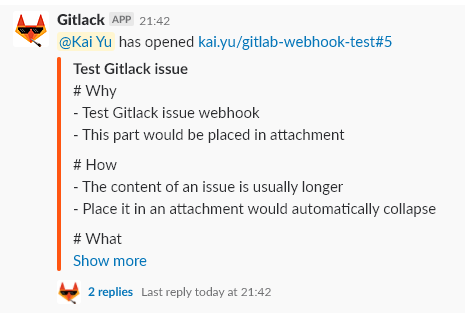
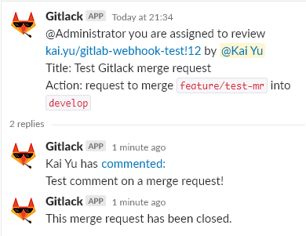

# Gitlack
:palm_tree: Gitlack will post the message on Slack and tag related people.  

# Quick Start
## Setup Slack
Please create a Slack apps that has the permission scopes:  
- `chat:write:bot`
- `users:read`
- `users:read.email`

Provide `OAuth Access Token` to Gitlack.  
(`Features -> OAuth & Permissions -> OAuth Tokens & Redirect URLs -> Tokens for Your Workspace`)  

See [Building Slack apps](https://api.slack.com/slack-apps) for more information.

## Setup Gitlack
```
make build
docker run -d --name ${CONTAINER_NAME} \
    -p 5000:5000 \
    gitlack:v0.0.1 \
    --slack-token YOUR-SLACK-TOKEN \
    --gitlab-token YOUR-GITLAB-TOKEN
```

## Setup GitLab
1. Head to your GitLab project and open `Settings -> Integrations`
2. Fill `URL` section with your Gitlack domain and port
3. Select the events you want to receive (see `Supported Events`)
4. Click `Add webhook`

## Setup Default Channel for Project or User
Gitlack will post message on Slack according to the default channel by GitLab projects or users.  
You can also add the string `/gitlack: CHANNEL-NAME` in description at the last line to override the default values.  
Here is the priority, the top will override the bottom:  
1. Setting in description, for example, merge request description or tag release notes
2. Project default channel
3. User default channel
4. `#general`

If you want to setup the default channel for projects or users, you can send a `PUT` HTTP request with `default_channel` in query string.  

API endpoint:
- User: `/api/user/:emailusername` (drop domain part)
- Project: `/api/project/:namespace/:path`

For example:  
- Change default channel of user:  
  `PUT /api/user/chihkaiyu?default_channel=random`, no need to add a `#` before channel name
- Get current settings of user:  
  `GET /api/user/chihkaiyu`
- Change default channel of project:  
  `PUT /api/project/chihkaiyu/gitlack?default_channel=random`, no need to add a `#` before channel name
- Get current settings of project:  
  `GET /api/project/chihkaiyu/gitlack`

# Configuration
## Parameters
```
--debug                  enable server debug mode
--slack-scheme value     Slack scheme, http or https, default https (default: "https")
--slack-domain value     Slack domain, default slack.com (default: "slack.com")
--slack-token value      token for accessing Slack
--gitlab-scheme value    GitLab scheme, http or https, default https (default: "https")
--gitlab-domain value    GitLab domain (default: "gitlab.com")
--gitlab-token value     token for accessing GitLab
--server-addr value      server address (default: ":5000")
--database-config value  database file path (default: "${WORKDIR}/db/gitlack.db")
```

## Persist Data From Docker
If you run Gitlack via Docker, you have to mount your SQLite file for next-time using.  
The default path is `/home/gitlack/db/gitlack.db` in container. Simply mount it to your host would persist your data.  
For example,
```
docker run -d --name ${CONTAINER_NAME} \
    -p 5000:5000 \
    -v /path/to/your/gitlab.db:/home/gitlack/db/gitlack.db \
    gitlack:v0.0.1 \
    --slack-token YOUR-SLACK-TOKEN \
    --gitlab-token YOUR-GITLAB-TOKEN
```

# Event Behavior
## Supported Events
- Merge Request
- Tag Push
- Issues
- Comments

## Merge Request Events
- Tagged users
    - Assignee (use name in GitLab if there is no Slack ID)
    - Author (use name in GitLab if there is no Slack ID)
- According to whose default channel
    - Assignee
- Example  


## Tag Push Events
- Tagged users
    - Author (use name in GitLab if there is no Slack ID)
- According to whose default channel
    - Author
- Example  


## Issues Events
- Tagged users
    - Author (use name in GitLab if there is no Slack ID)
- According to whose default channel
    - Author
- Example  


## Comments Events
- Tagged users
    - None
- According to whose default channel
    - Post message to the Slack thread
- Example  
